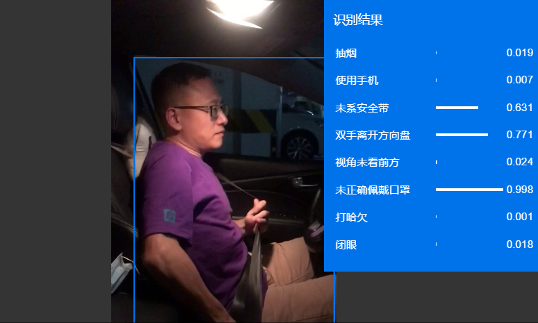
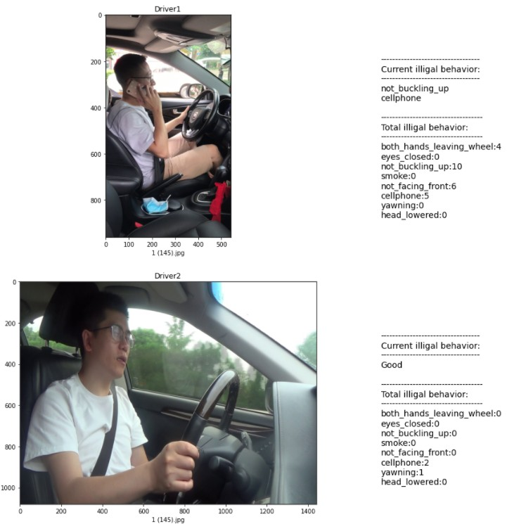

# 驾驶行为实时监控和报警示例

本示例演示内容为，同时对两位司机的驾驶行为进行识别和监控。

## 输入源：

使用手机摄像头，对司机驾驶行为进行了拍摄。通过前期预处理，将视频进行了连续图片采样，放入对应文件夹中，作为输入源。


## 实现步骤：

1. 通过io.pravega.example.flink.demo.MyWriter，连续读取driver1和driver2两个目录中的图片，然后写入到一个standalone运行模式下的pravega中。
2. 通过io.pravega.example.flink.demo.MyReader，从praveag中读取数据，然后调用百度AI平台提供的驾驶行为分析API，将结果写入csv。
3. 通过jupyter将两位司机的图片和驾驶行为的识别数据进行展示。


## 百度驾驶行为分析API，可识别行为如下

使用手机、抽烟、不系安全带、未佩戴口罩、闭眼、打哈欠、视角未朝前方等9大类行为属性



## 代码运行步骤

本实例的运行环境为CentOS 8, java11
### 1. 启动pravega 0.9.1 实例

从[GitHub Releases](https://github.com/pravega/pravega/releases)下载pravega编译好的压缩包，然后进行解压.

```
$ tar xfvz pravega-0.9.1.tgz
```

启动Pravega:

```
$ pravega-0.9.1/bin/pravega-standalone
```

### 2. 下载并运行本示例代码

将本示例代码放置到/root/ 目录下
```
[root@localhost flink-pravega-demo]# pwd
/root/flink-pravega-demo

[root@localhost flink-pravega-demo]# ls
dependency-reduced-pom.xml  images  jupyter  out.csv  pom.xml  reader.sh  src  start.sh  target  writer.sh
```

- images 目录下存放驾驶员的源图片
- out.csv 用于记录驾驶员行为识别的结果

如果是其他路径，需要修改如下地方：
MyWriter.java 中dirPath1，dirPath2为新的绝对路径
FileSink.java 中out.csv的新的绝对路径
demo.ipynb 中path为新的out.csv 绝对路径

使用百度API，需要提供clineId 和 clientSecret，填写到src/main/java/io/pravega/example/flink/demo/baidu/AuthService.java中


第一次使用时，需要编译和拷贝依赖文件
```
[root@localhost flink-pravega-demo]# mvn clean package
[root@localhost flink-pravega-demo]# mvn dependency:copy-dependencies
```

执行写操作，将图片源写入pravega
```
[root@localhost flink-pravega-demo]# ./writer.sh
```

执行读操作，将图片从pravega中取出，然后调用百度api,进行驾驶行为的分析，然后将json格式的分析结果存入到 /root/flink-pravega-demo/out.csv
```
[root@localhost flink-pravega-demo]# ./reader.sh
```

打开jupyter, 在浏览器中查看识别结果
```
[root@localhost flink-pravega-demo]# cd jupyter/
[root@localhost jupyter]# ls
demo.ipynb
[root@localhost jupyter]# jupyter notebook --allow-root

```



